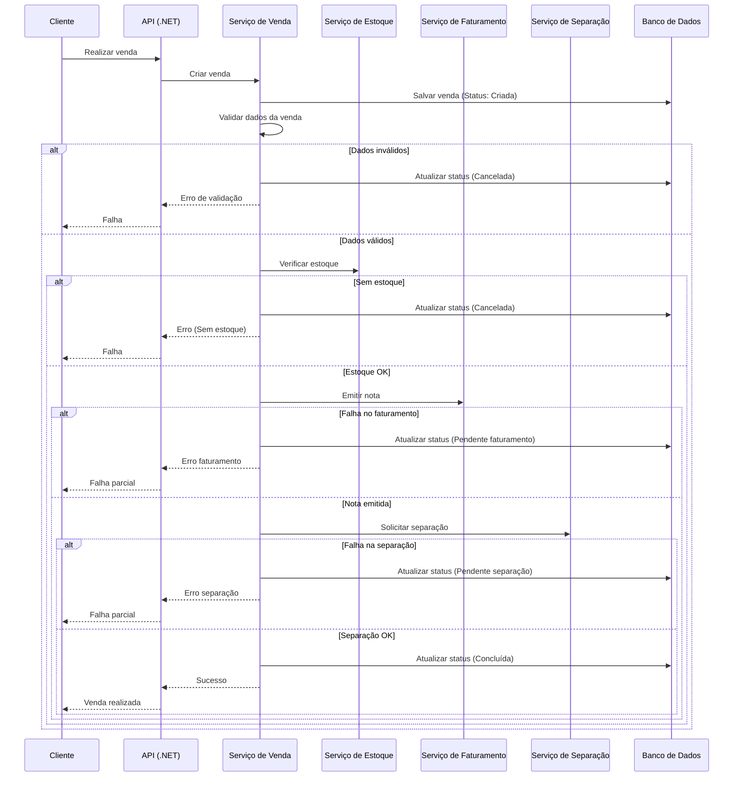

```mermaid
sequenceDiagram

participant C as Cliente
participant API as API (.NET)
participant V as Serviço de Venda
participant E as Serviço de Estoque
participant F as Serviço de Faturamento
participant S as Serviço de Separação
participant DB as Banco de Dados

C->>API: Realizar venda
API->>V: Criar venda

V->>DB: Salvar venda (Status: Criada)

%% Validação inicial
V->>V: Validar dados da venda

alt Dados inválidos
    V->>DB: Atualizar status (Cancelada)
    V-->>API: Erro de validação
    API-->>C: Falha

else Dados válidos

     %% Estoque
    V->>E: Verificar estoque

    alt Sem estoque
        V->>DB: Atualizar status (Cancelada)
        V-->>API: Erro (Sem estoque)
        API-->>C: Falha

    else Estoque OK

        %% Faturamento
        V->>F: Emitir nota

        alt Falha no faturamento
            V->>DB: Atualizar status (Pendente faturamento)
            V-->>API: Erro faturamento
            API-->>C: Falha parcial

        else Nota emitida

            %% Separação
            V->>S: Solicitar separação

            alt Falha na separação
                V->>DB: Atualizar status (Pendente separação)
                V-->>API: Erro separação
                API-->>C: Falha parcial

            else Separação OK

                V->>DB: Atualizar status (Concluída)
                V-->>API: Sucesso
                API-->>C: Venda realizada

            end
        end
    end
end
```